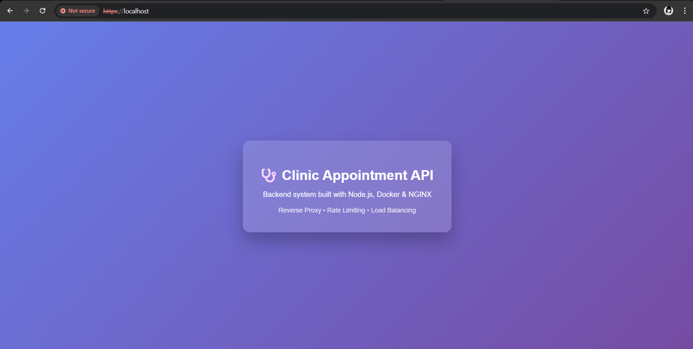

# 🏥 Clinic Appointment API

A production-ready backend system for managing clinic patients, doctors, and appointment scheduling.

The application is containerized with Docker and secured using NGINX as a reverse proxy, featuring HTTPS, rate limiting, and load balancing for scalable and secure deployments.

---

📸 Preview


---

## 📘 Project Description

**Clinic Appointment API**
is a professional backend system that enables clinics to manage their daily operations digitally.

It allows:

- Managing patients and doctors
- Booking and canceling appointments
- Enforcing critical business rules such as preventing double bookings
- Validating appointment data

The project follows a clean layered architecture and demonstrates a production-style Docker + NGINX setup suitable for real-world backend services.

---

## 🚀 Key Features

- Patient management (create & list patients)

- Doctor management with specialties

- Appointment booking and cancellation

- Prevents double booking for doctors

- Input validation for dates, times, and IDs

- Clean layered architecture (Routes → Controllers → Services)

- File-based persistence using JSON

- NGINX reverse proxy

- NGINX rate limiting for API protection

- NGINX load balancing with multiple backend instances

- Backend service isolation inside Docker network

- Lightweight frontend landing page for API presentation

- Dockerized with multi-stage build

- Healthcheck endpoint for container monitoring

- HTTPS enabled using SSL/TLS

- Healthcheck endpoint for container monitoring

- Docker Compose support

- CI pipeline using GitHub Actions

- Makefile for simplified Docker commands

---

## 🧰 Technology Stack

- Node.js
- Express.js
- REST API
- Docker & Docker Compose
- NGINX (Reverse Proxy & Load Balancer)
- GitHub Actions (CI)
- NGINX (Reverse Proxy & Load Balancer)
- Makefile
- File-based storage (JSON)

---

## 🏗 System Architecture

```txt
Client (Browser / Postman)
        |
        v
NGINX (Reverse Proxy + Rate Limiting)
        |
        v
Multiple Backend API Instances
(Load Balanced via Docker Network)

```

## 📁 Repository Structure

```txt
clinic-appointment-api/
├── src/
│   ├── controllers/
│   ├── services/
│   ├── routes/
│   ├── validators/
│   ├── data/
│   ├── utils/
│   ├── public/
│   │   └── index.html
│   └── app.js
├── nginx/
│   └── nginx.conf
├── certs/
│   ├── localhost.crt
│   └── localhost.key
├── docs/
│   ├── screenshots/
│   └── notes.md
├── .github/workflows/
│   └── docker-ci.yml
├── Dockerfile
├── docker-compose.yml
├── Makefile
├── .dockerignore
├── .gitignore
├── README.md
└── LICENSE


```

---

## 🐳 Docker & NGINX Setup

▶ Run the Application 

```bash
docker compose up --build --scale clinic-api=2
```

This will:

- Start two backend API instances

- Start NGINX as a reverse proxy

- Enable load balancing between backend instances

- Expose the application on port 80

Application URL:

```bash
https://localhost
```

_📡 API Endpoints_

### Patients

| Method | Endpoint  | Description       |
| ------ | --------- | ----------------- |
| GET    | /patients | Get all patients  |
| POST   | /patients | Add a new patient |

```json
{
  "name": "Leenah",
  "age": 22,
  "phone": "0591234567"
}
```

---

### Doctors

| Method | Endpoint | Description     |
| ------ | -------- | --------------- |
| GET    | /doctors | Get all doctors |
| POST   | /doctors | Add a doctor    |

```json
{
  "name": "Dr. Ahmad",
  "specialty": "Dentist",
  "phone": "0599876543"
}
```

---

### Appointments

| Method | Endpoint          | Description          |
| ------ | ----------------- | -------------------- |
| GET    | /appointments     | Get all appointments |
| POST   | /appointments     | Book appointment     |
| DELETE | /appointments/:id | Cancel appointment   |

```json
{
  "patientId": 1,
  "doctorId": 1,
  "date": "2026-01-20",
  "time": "12:00"
}
```

---

_✅ Healthcheck_

_GET_ `/health`

_Example response:_

```json
{
  "status": "OK"
}
```

---

## ⚙ Configuration

| Variable | Description                      |
| -------- | -------------------------------- |
| PORT     | Application port (default: 3000) |

No environment variables are required.

---

## 🧪 Testing

You can test the API using:

- Browser
- Postman
- cURL

**Example:**

http://localhost:3000/patients

---

## 📄 Technical Notes

Technical notes and challenges are documented in:

docs/notes.md

Includes:

- Biggest Docker issue faced and solution
- Most important Git/GitHub lesson learned

---

## Production Deployment (VPS)

The application was deployed on a Virtual Private Server using Docker.
Steps:
1. Install Git and Docker on the VPS
2. Clone the repository
3. Build the Docker image
4. Run the container

---

### Production URL
```bash
https://clinicapivps-fnkto28r.b4a.run/
```

---
## 👩‍💻 Author

**Leenah Alborsh**
Software Development Student
Backend | Full-Stack Developer

---

📄 Deployment Experience & Notes

Deployment challenges and solutions are documented in:
```bash
docs/notes.md
```
---

## 🔮 Future Improvements

- Authentication (JWT)
- Database integration (MongoDB / PostgreSQL)
- API documentation with Swagger
- Unit & integration testing
- Role-based access control

---

This project was cloned and deployed from a Claw Cloud Devbox using GitHub integration.

---

## 📜 License

This project is licensed under the MIT License.
Deployed from Claw Cloud Devbox using GitHub integration.
